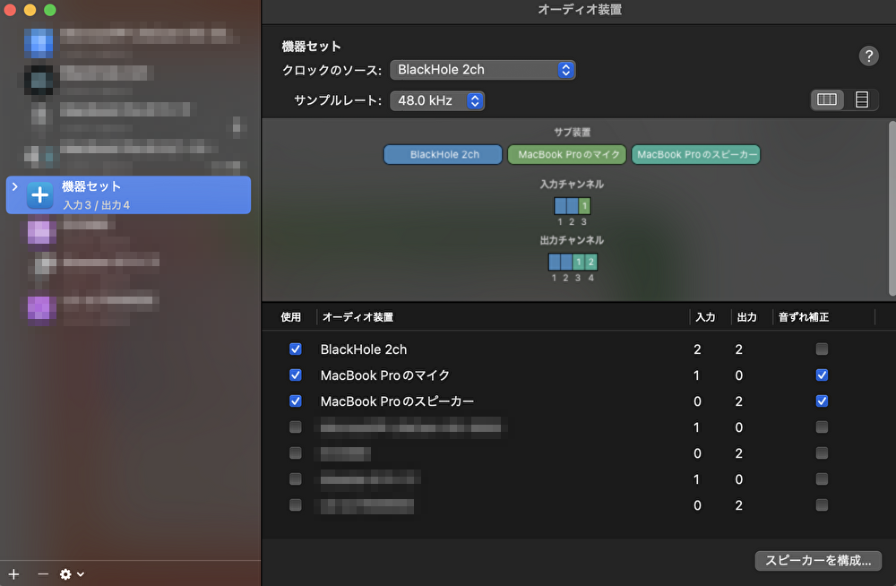

# whisper-realtime-with-gui

refs: https://github.com/openai/whisper

## Install
Assuming Python 3.9.9 is installed.
```sh
brew install python-tk@3.9 # for GUI
brew install ffmpeg # requires by whisper
brew install blackhole-2ch # combine mic and speaker
# You must reboot for the installation of blackhole-2ch to take effect.
brew install pipenv
pipenv install
```

## Settings
### Audio MIDI Settings
Create "機器セット" like this screenshot.


### create .env
```sh
cp .env.sample .env
```
Put your audio device name to .env  
You can change whisper model `WHISPER_MODEL`.
[Usable list](https://huggingface.co/collections/mlx-community/whisper-663256f9964fbb1177db93dc)

## Start
```sh
pipenv shell
python main.py
# A GUI with “Start” and “Stop” buttons will launch.
# Pressing “Start” begins voice recognition, and pressing “Stop” stops it.
# First time, you need to download whisper model.
# So, it takes a little time to start up.
```
